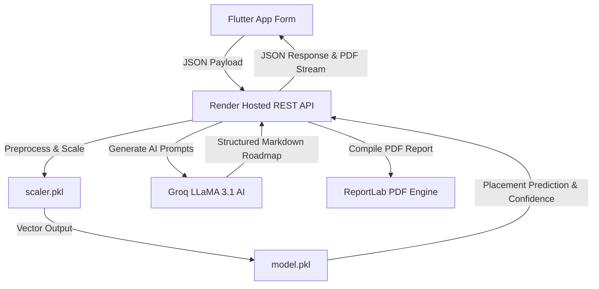

# CareerFit AI 🎓

An advanced **AI-powered Student Placement Predictor & Mentorship Advisor**. This repository contains a production-ready **Flutter Mobile Application** fully integrated with our hosted **Flask Machine Learning REST API** on Render.

---

## 🏗️ System Architecture & Data Flow



---

## 📁 Project Directory Structure

```
placement_predictor_app/
├── lib/
│   ├── main.dart                      # Bootstrap entry point
│   ├── app.dart                       # Global MaterialApp & state initializers
│   ├── core/                          # Base utilities and constants
│   │   ├── constants/
│   │   │   ├── app_colors.dart        # Vibrant light/dark visual tokens
│   │   │   ├── app_strings.dart       # App string constants & routes
│   │   │   └── api_constants.dart     # Endpoint maps pointing to live Render
│   │   ├── theme/
│   │   │   └── app_theme.dart         # Material 3 light/dark style declarations
│   │   └── utils/
│   │       ├── validators.dart        # Numeric range form validators
│   │       └── helpers.dart           # UI feedback snacks & string utilities
│   ├── models/                        # Object schemas
│   │   ├── prediction_request.dart    # 7-metric request model
│   │   ├── prediction_result.dart     # Prediction status & confidence data
│   │   └── prediction_history.dart    # Serialized persistent history schema
│   ├── services/
│   │   └── api_service.dart           # HTTP Client with production error boundaries
│   ├── providers/
│   │   ├── prediction_provider.dart   # Coordinate diagnostics state & file paths
│   │   └── theme_provider.dart        # Switch themes dynamically (SharedPreferences)
│   ├── routing/
│   │   └── app_router.dart            # MaterialPageRoute mapping
│   ├── screens/                       # Presentation layer views
│   │   ├── splash/splash_screen.dart  # Animated startup view
│   │   ├── home/home_screen.dart      # Dashboard with executive metrics cards
│   │   ├── prediction/prediction_form_screen.dart # 7-slider diagnostics form
│   │   ├── result/result_screen.dart  # Result badges & Markdown AI roadmaps
│   │   └── history/history_screen.dart # Diagnostic archives
│   └── widgets/                       # Reusable UI components
│       ├── custom_text_field.dart
│       ├── gradient_button.dart
│       ├── skill_slider.dart
│       ├── result_card.dart
│       ├── history_tile.dart
│       └── loading_overlay.dart
├── assets/
│   └── images/                        # Graphics & application assets
├── android/                           # Native Android wrapper (configured with internet permissions)
├── ios/                               # Native iOS wrapper
├── pubspec.yaml                       # Application packaging configurations
└── README.md                          # Detailed documentation
```

---

## ⚡ Production Deployed Endpoints

The Flutter application communicates directly with the live Render host:
**Base URL**: `https://placement-ml-project.onrender.com`

1. **`GET /api/health`**: Diagnostic check confirming backend availability and ML model loading states.
2. **`POST /predict`**: Accepts a JSON payload containing the 7 features and returns predictions and confidence metrics:
   ```json
   {
     "cgpa": 8.5,
     "aptitude_score": 85.0,
     "coding_skills": 8.0,
     "internships": 1,
     "certifications": 3,
     "communication_skills": 90.0,
     "projects": 2
   }
   ```
3. **`POST /generate-report`**: Hands over prediction outputs and inputs to the **Groq LLaMA 3.1** engine to generate a step-by-step career improvement roadmap.
4. **`POST /download_report`**: Compiles a highly structured PDF document using the **ReportLab** layout engine and returns the binary stream directly.

---

## 🚀 Setup & Installation

### Running the App Locally

1. Change directory to the Flutter project:
   ```bash
   cd placement_predictor_app
   ```
2. Download packages:
   ```bash
   flutter pub get
   ```
3. Run the app:
   ```bash
   flutter run
   ```
   *The app connects directly to the live Render cloud backend. No local Flask server is required.*

---

## 📦 Bundling the Flutter Mobile Application for Google Play Store

Follow these steps to generate a production-ready **Android App Bundle (.aab)** for publication on the Google Play Console:

### 1. Pre-requisites & Signing Setup
To publish on the Google Play Store, you must sign your application:
1. Generate an upload keystore:
   ```bash
   keytool -genkey -v -keystore android/app/upload-keystore.jks -keyalg RSA -keysize 2048 -validity 10000 -alias upload
   ```
2. Create a `key.properties` file in `android/` containing credentials pointing to the keystore:
   ```properties
   storePassword=<your-store-password>
   keyPassword=<your-key-password>
   keyAlias=upload
   storeFile=upload-keystore.jks
   ```
3. Update `android/app/build.gradle.kts` to reference `key.properties` for release signing config.

### 2. Clean and Fetch Packages
```bash
flutter clean
flutter pub get
```

### 3. Generate Android App Bundle (.aab)
```bash
flutter build appbundle --release
```
*This compiles the production package optimized for different device form factors. The resulting bundle will be saved at:*
`build/app/outputs/bundle/release/app-release.aab`

### 4. Optional: Generate standalone release APK
```bash
flutter build apk --release
```
*The resulting APK will be saved at:*
`build/app/outputs/apk/release/app-release.apk`
